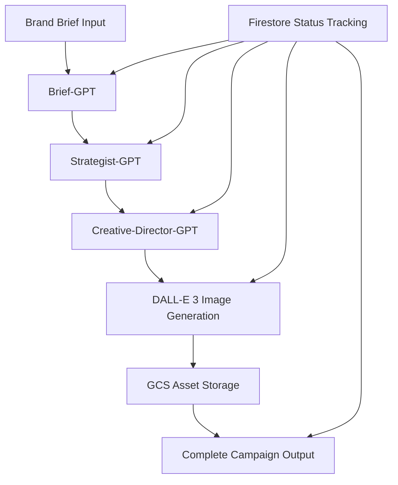

# AI Pipeline Technical Guide

## Overview

The Bezz AI pipeline implements a sophisticated multi-stage AI processing system that transforms raw brand briefs into complete brand strategies with ready-to-use advertising campaigns. This document provides detailed technical information for developers working with the AI pipeline.

## Architecture Overview



## Pipeline Stages

### Stage 1: Brief Analysis (Brief-GPT)

**Purpose**: Convert unstructured founder inputs into structured brand data

**Input**: Raw brand brief form data
```go
type BrandBrief struct {
    CompanyName    string
    Sector         string
    Tone           string
    TargetAudience string
    Language       string
    AdditionalInfo string
}
```

**Output**: Structured brand goals and insights
```go
type BriefGPTResponse struct {
    BrandGoal string `json:"brand_goal"`
    Audience  string `json:"audience"`
    Tone      string `json:"tone"`
    Vision    string `json:"vision"`
}
```

**Implementation Details**:
- Uses GPT-4 with structured prompt template
- Temperature: 0.3 for consistency
- Max tokens: 1000
- Validation: JSON schema enforcement

### Stage 2: Strategy Generation (Strategist-GPT)

**Purpose**: Generate comprehensive brand strategy from brief analysis

**Input**: BriefGPTResponse JSON
**Output**: Complete brand strategy including positioning, messaging, personas

```go
type StrategistGPTResponse struct {
    PositioningStatement string                       `json:"positioning_statement"`
    ValueProposition     string                       `json:"value_proposition"`
    BrandPillars         []string                     `json:"brand_pillars"`
    MessagingFramework   StrategistMessagingFramework `json:"messaging_framework"`
    TargetSegments       []StrategistTargetSegment    `json:"target_segments"`
    CampaignAngles       []CampaignAngle              `json:"campaign_angles"`
}
```

**Implementation Details**:
- Temperature: 0.5 for creative but consistent output
- Max tokens: 2500
- Generates exactly 3 target personas
- Creates 3 distinct campaign angles

### Stage 3: Creative Development (Creative-Director-GPT)

**Purpose**: Generate ad copy and visual concepts from brand strategy

**Input**: Complete brand strategy JSON
**Output**: 3 diverse ad specifications

```go
type CreativeDirectorGPTResponse struct {
    Ads []AdSpec `json:"ads"`
}

type AdSpec struct {
    ID          int    `json:"id"`
    Headline    string `json:"headline"`    // ≤20 words
    Body        string `json:"body"`        // ≤50 words  
    DallePrompt string `json:"dalle_prompt"` // Detailed visual description
}
```

**Implementation Details**:
- Temperature: 0.7 for creative diversity
- Max tokens: 2000
- Enforces word count limits
- Generates detailed DALL-E prompts for brand consistency

### Stage 4: Visual Asset Creation (DALL-E 3)

**Purpose**: Generate high-quality images for each ad campaign

**Concurrent Processing**:
```go
var wg sync.WaitGroup
results := make([]models.AdCampaign, len(adSpecs))

for i, spec := range adSpecs {
    wg.Add(1)
    go func(index int, adSpec models.AdSpec) {
        defer wg.Done()
        campaign, err := s.generateSingleAd(ctx, adSpec, companyName)
        results[index] = *campaign
    }(i, spec)
}
wg.Wait()
```

**DALL-E 3 Configuration**:
- Model: `dall-e-3`
- Size: `1024x1024`
- Quality: `standard`
- Response format: `url`
- Rate limit: 50 requests/minute

**Error Handling & Retry Logic**:
```go
const maxRetries = 2
for attempt := 0; attempt <= maxRetries; attempt++ {
    if attempt > 0 {
        time.Sleep(time.Duration(attempt) * 2 * time.Second) // Exponential backoff
    }
    
    imageURL, err := s.generateImage(ctx, spec.DallePrompt)
    if err == nil {
        break // Success
    }
}
```

### Stage 5: Asset Storage (Google Cloud Storage)

**Purpose**: Store generated images with public access

**GCS Configuration**:
```go
bucket := s.storageClient.Bucket(s.bucketName)
obj := bucket.Object(objectName + ".png")

writer := obj.NewWriter(ctx)
writer.ContentType = "image/png"

// Make publicly readable
obj.ACL().Set(ctx, storage.AllUsers, storage.RoleReader)
```

**File Organization**:
```
bucket/
├── ads/
│   ├── company_name_ad_1_timestamp.png
│   ├── company_name_ad_2_timestamp.png
│   └── company_name_ad_3_timestamp.png
```

## Status Tracking

The pipeline maintains real-time status updates in Firestore:

```go
const (
    StatusProcessing        = "processing"
    StatusStrategyCompleted = "strategy_completed"  
    StatusAdsCompleted     = "ads_completed"
    StatusCompleted        = "completed"
    StatusFailed           = "failed"
)
```

**Status Flow**:
1. `processing` - Brief-GPT → Strategist-GPT in progress
2. `strategy_completed` - Strategy generated, starting creative development
3. `ads_completed` - Ad copy generated, images being created
4. `completed` - Full pipeline finished successfully
5. `failed` - Error occurred at any stage

## Error Handling Strategies

### Graceful Degradation

**Partial Success Support**:
- If 2/3 images generate successfully, mark as completed
- Store ads without images if DALL-E fails entirely
- Continue pipeline even if non-critical steps fail

**Error Categories**:

1. **API Errors**:
   - Rate limiting (429) → Exponential backoff retry
   - Content policy violation (400) → Skip image, continue
   - Quota exceeded (429) → Graceful failure with notification

2. **JSON Parsing Errors**:
   - Invalid response format → Retry with adjusted prompt
   - Missing required fields → Use fallback values
   - Schema validation failure → Log and continue with partial data

3. **Storage Errors**:
   - GCS upload failure → Use direct OpenAI URL as fallback
   - Permission errors → Log error, continue with direct URLs
   - Network timeouts → Retry with exponential backoff

### Monitoring & Logging

**Structured Logging**:
```go
log.Printf("🧠 AI PIPELINE: Starting processing for brief %s", brief.ID)
log.Printf("🎨 AI PIPELINE: Creative-Director-GPT raw response: %s", content)
log.Printf("🖼️ AI PIPELINE: Generated %d/%d images successfully", successCount, len(adSpecs))
log.Printf("❌ AI PIPELINE: DALL-E 3 API call failed: %v", err)
```

**Performance Metrics**:
- Pipeline completion time
- Individual stage duration  
- Success/failure rates per stage
- Token usage tracking
- Image generation success rate

## Testing Strategy

### Unit Tests

**AI Service Tests**:
```go
func TestGenerateAds_Success(t *testing.T) {
    mockClient := &MockOpenAIClient{
        MockResponse: openai.ChatCompletionResponse{
            Choices: []openai.ChatCompletionChoice{{
                Message: openai.ChatCompletionMessage{
                    Content: `{"ads": [{"id": 1, "headline": "Test", "body": "Test body", "dalle_prompt": "Test prompt"}]}`,
                },
            }},
        },
    }
    
    service := NewTestableAIService(mockClient)
    strategy := &models.BrandStrategy{Positioning: "Test positioning"}
    
    response, err := service.GenerateAds(context.Background(), strategy)
    
    assert.NoError(t, err)
    assert.Len(t, response.Ads, 1)
}
```

**Mock Interfaces**:
```go
type OpenAIClientInterface interface {
    CreateChatCompletion(ctx context.Context, request openai.ChatCompletionRequest) (openai.ChatCompletionResponse, error)
    CreateImage(ctx context.Context, request openai.ImageRequest) (openai.ImageResponse, error)
}
```

### Integration Tests

**Full Pipeline Testing**:
```bash
# Test complete brief-to-ads flow
go test ./internal/handlers -v -run TestCreateBrief_CompleteAIPipeline

# Test concurrent image generation
go test -race ./internal/services -v -run TestRenderImages

# Test error handling
go test ./internal/services -v -run TestGenerateAds_Error
```

### Load Testing

**Concurrent Brief Processing**:
```go
func TestConcurrentBriefProcessing(t *testing.T) {
    const numBriefs = 10
    var wg sync.WaitGroup
    
    for i := 0; i < numBriefs; i++ {
        wg.Add(1)
        go func(briefID int) {
            defer wg.Done()
            // Process brief concurrently
            brief := createTestBrief(briefID)
            service.ProcessBrief(context.Background(), brief)
        }(i)
    }
    
    wg.Wait()
}
```

## Performance Optimization

### Concurrent Processing

**Image Generation Parallelization**:
- All 3 images generated simultaneously using goroutines
- `sync.WaitGroup` ensures completion before proceeding
- Prevents sequential 30-60 second waits per image

**Memory Management**:
```go
// Limit concurrent image downloads
semaphore := make(chan struct{}, 3)
for i, spec := range adSpecs {
    semaphore <- struct{}{} // Acquire
    go func(spec models.AdSpec) {
        defer func() { <-semaphore }() // Release
        generateSingleAd(ctx, spec, companyName)
    }(spec)
}
```

### Caching Strategies

**Strategy Caching** (Future Enhancement):
```go
// Cache similar brand strategies to reduce API calls
type StrategyCache struct {
    mu    sync.RWMutex
    cache map[string]*models.BrandStrategy
}

func (c *StrategyCache) Get(key string) (*models.BrandStrategy, bool) {
    c.mu.RLock()
    defer c.mu.RUnlock()
    strategy, exists := c.cache[key]
    return strategy, exists
}
```

### Rate Limit Management

**OpenAI Rate Limits**:
- GPT-4: 10,000 requests/minute
- DALL-E 3: 50 requests/minute (bottleneck)

**Rate Limiter Implementation**:
```go
import "golang.org/x/time/rate"

type AIService struct {
    client      *openai.Client
    rateLimiter *rate.Limiter // 45 requests/minute with burst of 5
}

func (s *AIService) generateImage(ctx context.Context, prompt string) (string, error) {
    if err := s.rateLimiter.Wait(ctx); err != nil {
        return "", err
    }
    
    return s.client.CreateImage(ctx, request)
}
```

## Security Considerations

### Content Moderation

**Input Validation**:
```go
func validateBriefContent(brief *models.BrandBrief) error {
    // Check for inappropriate content in user inputs
    resp, err := openaiClient.Moderations(ctx, openai.ModerationRequest{
        Input: []string{brief.AdditionalInfo, brief.TargetAudience},
    })
    
    if resp.Results[0].Flagged {
        return errors.New("content policy violation")
    }
    return nil
}
```

**Image Prompt Sanitization**:
- Automatically filter sensitive terms from DALL-E prompts
- Implement company-specific content guidelines
- Log and review flagged content for policy updates

### Data Privacy

**PII Handling**:
- Never log complete user inputs in production
- Sanitize logs of personal/company information
- Implement data retention policies for generated content

**API Key Security**:
```go
// Rotate OpenAI API keys regularly
type APIKeyRotator struct {
    keys    []string
    current int
    mu      sync.Mutex
}

func (r *APIKeyRotator) GetKey() string {
    r.mu.Lock()
    defer r.mu.Unlock()
    key := r.keys[r.current]
    r.current = (r.current + 1) % len(r.keys)
    return key
}
```

## Deployment Considerations

### Environment Configuration

**Production Settings**:
```bash
# AI Service Configuration
OPENAI_API_KEY=sk-proj-production-key
OPENAI_ORG_ID=org-production-id

# DALL-E Rate Limiting
DALLE_RATE_LIMIT=45  # requests per minute
DALLE_BURST_LIMIT=5  # burst allowance

# GCS Configuration  
GCS_BUCKET_NAME=bezz-production-assets
GCS_PROJECT_ID=bezz-production

# Pipeline Timeouts
AI_PIPELINE_TIMEOUT=300s  # 5 minutes total
IMAGE_GENERATION_TIMEOUT=60s  # per image
```

### Monitoring & Alerting

**Key Metrics to Monitor**:
- Pipeline success rate (target: >95%)
- Average processing time (target: <3 minutes)
- Image generation success rate (target: >90%)
- API error rates (target: <5%)
- Token usage per brief (budget monitoring)

**Alert Thresholds**:
```yaml
alerts:
  - name: high_pipeline_failure_rate
    condition: failure_rate > 10%
    duration: 5m
    
  - name: dalle_quota_exhausted  
    condition: dalle_requests_remaining < 100
    duration: 1m
    
  - name: processing_time_high
    condition: avg_processing_time > 300s
    duration: 10m
```

### Scalability Planning

**Horizontal Scaling**:
- Stateless AI service design enables easy horizontal scaling
- Load balancer distributes briefs across multiple instances
- Shared Firestore ensures consistent state management

**Queue-Based Processing** (Future Enhancement):
```go
type BriefProcessor struct {
    queue    chan *models.BrandBrief
    workers  int
    aiService *AIService
}

func (p *BriefProcessor) Start() {
    for i := 0; i < p.workers; i++ {
        go p.worker()
    }
}

func (p *BriefProcessor) worker() {
    for brief := range p.queue {
        p.aiService.ProcessBrief(context.Background(), brief)
    }
}
```

This technical guide provides the foundation for understanding, extending, and maintaining the Bezz AI pipeline. For additional implementation details, refer to the source code and unit tests. 